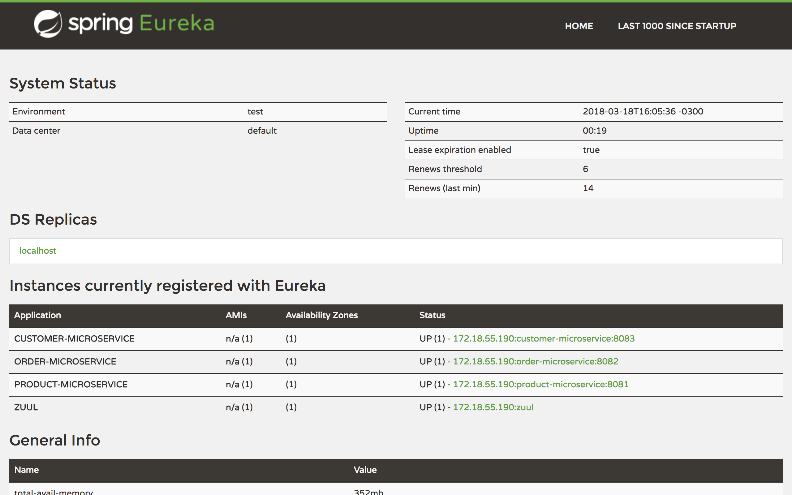

# Skip the Dishes VanHackathon

Create API using some tools of [Spring Cloud](http://cloud.spring.io/)

## Getting Started

The project is divided in many microservices, with Zuul to authenticate, Gateway API and load balance for the requests.
It also use Eureka to register the microservice how is the image below.



### Prerequisites

```
Java 8
```
```
Mysql
```

## Running the tests

Use to run all tests
```
npm run test
```
Use to run unit tests
```
npm run test-unit
```
Use to run integration tests
```
npm run test-integration
```

## Authors

* **Christian Franco Soares** 
